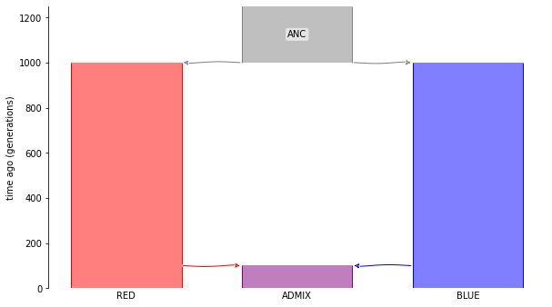
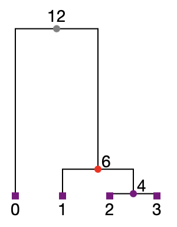
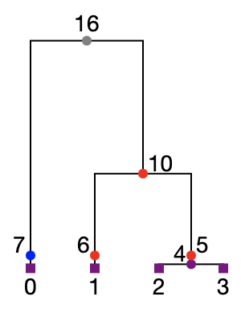

.. _simulationsetup:

Simulation setup
================

Population-based ancestry is only well-defined with reference to some
particular time.
For instance, suppose that my maternal grandmother belonged to Population A,
and my mother migrated into Population B.
I inherited some of my genome from these ancestors --  but which population did it come from?
The answer depends on a point in *time* -- and in particular,
on whether we are interested in ancestry one or two generations ago.

By default, ``msprime`` and ``SLiM`` do not retain information about the ancestry of individuals at each timepoint in the simulated history.
The rest of this page explains how to rectify this.

.. note::

	Update this so that the demographic scenario is written in Demes, and then exported to `msprime` and `SLiM`.

``msprime`` simulations
-----------------------

Let's make this more concrete with an example.

Suppose there was an admixture event between two populations,
`RED` and `BLUE`, that produces an admixed population `ADMIX`.
The admixture happened 100 generations ago.
These two populations split from a common ancestral population,
`ANC`.
The split was 1000 generations ago.

Here's a ``msprime.Demography`` object describing this demographic scenario:

.. code-block:: python

	import msprime

	pop_size = 500
	demography = msprime.Demography()
	demography.add_population(name="RED", initial_size=pop_size)
	demography.add_population(name="BLUE", initial_size=pop_size)
	demography.add_population(name="ADMIX", initial_size=pop_size)
	demography.add_population(name="ANC", initial_size=pop_size)
	demography.add_admixture(
	    time=100, derived="ADMIX", ancestral=["RED", "BLUE"], proportions=[0.5, 0.5]
	)
	demography.add_population_split(
	    time=1000, derived=["RED", "BLUE"], ancestral="ANC"
	)

We'll simulate a 100kb genomic region for two diploid individuals from the admixed population `ADMIX`:

.. code-block:: python

	ts = msprime.sim_ancestry(
	    samples={"RED": 0, "BLUE": 0, "ADMIX" : 2},
	    demography=demography,
	    random_seed=1011,
	    sequence_length=100000,
	    recombination_rate=3e-8
	)

Have a look at `this msprime tutorial <https://tskit.dev/msprime/docs/stable/ancestry.html>`_ if you need a refresher on this syntax.

By default, the tree sequences generated by `msprime` will only show the ancestral haplotypes that happen to be coalescent ancestors.
On their own, this is not sufficient to get information about population-based ancestry at all locations along the genome.

For instance, here is the first tree in the tree sequence generated by the
simulation above.
This tree describes the genealogical relationships between the samples on the leftmost part of the simulated genome:

.. code-block:: python

	# Note that this code will only work in a Jupyter notebook
	from IPython.display import SVG

	colour_map = {0:"red", 1:"blue", 2: "purple", 3: "gray"}
	node_colours = {u.id: colour_map[u.population] for u in ts.nodes()}
	tree = ts.first()
	SVG(tree.draw(node_colours=node_colours))

From this, we see that samples 1, 2 and 3 have ancestry with the red population at this location in their genomes.
However, we cannot be sure about the provenance of sample 0 based on the information displayed here.
At this genomic location, sample 0 is very deeply diverged from the other samples.
In fact, it is so deeply diverged that it's most recent coalescence with the other samples (at node 12) pre-dates the 'split' between the red and blue ancestral populations.
To see which population it has inherited from at this location,
we'd need to 'mark' one of the more recent (non-coalescent) ancestors of sample 0 to retain.

The ``msprime.Demography.add_census()`` method (documented `here <https://tskit.dev/msprime/docs/stable/api.html?highlight=add_census#msprime.Demography.add_census>`_) is a special demographic event that we added into ``msprime`` to do precisely this.
More specifically, ``add_census`` records a node on all lineages that are extant at some user-specified time in the simulation.
This is needed to simulate complete information about local ancestry.

The code below is the same that we specified above,
but with a census event at ``time=100.001``.
Note that this time is just before the admixture event creating population ``ADMIX``.

.. code-block:: python

	# Make the Demography object.
	demography = msprime.Demography()
	demography.add_population(name="RED", initial_size=pop_size)
	demography.add_population(name="BLUE", initial_size=pop_size)
	demography.add_population(name="ADMIX", initial_size=pop_size)
	demography.add_population(name="ANC", initial_size=pop_size)
	demography.add_admixture(
	    time=100, derived="ADMIX", ancestral=["RED", "BLUE"], proportions=[0.5, 0.5]
	)
	demography.add_census(time=100.01) # Census is here!
	demography.add_population_split(
	    time=1000, derived=["RED", "BLUE"], ancestral="ANC"
	)

	# Simulate.
	ts = msprime.sim_ancestry(
	    samples={"RED": 0, "BLUE": 0, "ADMIX" : 2},
	    demography=demography,
	    random_seed=1011,
	    sequence_length=100000,
	    recombination_rate=3e-8
	)

Here is a diagram of the first tree in the tree sequence returned by this simulation.

Note that there is now a node on *every* branch in the trees at the time specified in our census event.
(In the tree above, these are nodes 5, 6 and 7).
This is the information required to extract full information about population-based ancestry at all genomic locations in all samples.
For instance, we see here that sample 0 has local ancestry with the blue population,
while the other samples have ancestry with the red population.

``SLiM`` simulations
--------------------

.. note::

	Export above example to SLiM.

When should you add the census?
-------------------------------

You should specify the census event at a time when 

 1. All of the relevant ancestral populations are active.
 2. It is unlikely that all samples have coalesced anywhere.
 3.  There are no other coalescent nodes.

In the example above, condition 1 suggests that we should choose a census time between 100 and 1000 generations in the past.
Before this time, the populations did not 'exist', and after this time, the ancestors of the sample were already admixed.
To make condition 2 as likely as possible, we should choose a time closer to 100 and 1000.
The chosen time of ``100.01`` satisfies both of these conditions so far.
Since we are running a (default) coalescent simulation here, condition 3 is unlikely to be an issue.

.. note::

	Condition 3 is most important when you are running a DTWF simulation.
	In this situation, you want to avoid placing the census nodes 'on top' of the existing ancestors that are generated at discrete times,
	so a non-integer time is most suitable here.
